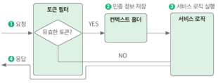

# 토큰 기반 인증
## 토큰 기반 인증이란?
토큰 기반 인증은 토큰을 사용하여 사용자가 인증된 사용자인지 확인하는 방법이다. 토큰은 서버에서 클라이언트를 구분하기 위한 유일한 값인데 서버가 토큰을 생성해서 클라이언트에게 제공하면, 클라이언트는 이 토큰을 갖고 있다가 여러 요청을 이 토큰과 함께 요청한다. 서버는 이 과정에서 토큰만 보고 유효한 사용자인지 검증한다.
### 토큰 기반 인증의 특징
- 무상태성: 사용자의 인증 정보가 담겨 있는 토큰이 서버가 아닌 클라이언트에 있으므로 서버에 저장할 필요가 없다. 클라이언트에서는 사용자의 인증 상태를 유지하면서 이후 요청을 처리해야 하는데 서버 입장에서는 클라이언트의 인증 정보를 저장하거나 유지하지 않아도 되기 때문에 stateless로 효율적인 검증을 할 수 있다.
- 확장성: 서버는 stateless이기 때문에 서버 확장에도 용이하다. 
- 무결성: 토큰 방식은 HMAC(hash-based message authentication) 기법이라고도 부른다. 토큰을 발급한 이후에는 토큰 정보를 변경하는 행위를 할 수 없다. 즉, 토큰의 무결성이 보장된다. 

## JWT
발급받은 JWT를 이용해 인증을 하려면 HTTP 요청 헤더 중에 Authorization 키값에 Bearer + JWT 토큰값을 넣어 보내야 한다. JWT는 헤더, 내용, 서명으로 이루어져있는데 각각의 역할은 다음과 같다
### 헤더
헤더에는 토큰의 타입과 해싱 알고리즘을 지정하는 정보를 담는다. 다음의 경우 JWT 토큰, HS256 해싱 알고리즘을 사용한다는 내용이다.
```json
    "typ": "JWT",
    "alg": "HS256"
```
헤더의 구성은 다음과 같다
- typ: 토큰의 타입을 지정한다. JWT라는 문자열이 들어가게 된다.
- alg: 해싱 알고리즘을 지정한다.
### 내용
내용에는 토큰과 관련된 정보를 담는다. 내용의 한 덩어리를 클레임이라고 부르며, 클레임은 키-값의 한 쌍으로 이루어져 있다. 클레임은 등록된 클레임, 공개 클레임, 비공개 클레임으로 나눌 수 있다.

등록된 클레임은 토큰에 대한 정보를 담는 데 사용한다.
- iss: 토큰 발급자
- sub: 토큰 제목
- aud: 토큰 대상자
- exp: 토큰의 만료 시간. 시간은 NumericDate 형식으로 하며, 항상 현재 시간 이후로 설정한다.
- nbf: 토큰의 활성 날짜와 비슷한 개념으로 nbf는 Not Before을 의미한다. NumericDate 형식으로 날짜를 지정하며, 이 날짜가 지나기 전까지는 토큰이 처리되지 않는다.
- iat: 토큰이 발급된 시간으로 iat은 issued at을 의미한다.
- jti: JWT의 고유 식별자로서 주로 일회용 토큰에 사용한다.

공개 클레임은 공개되어도 상관없는 클레임을 의미한다. 충돌을 방지할 수 있는 이름을 가져야 하며, 보통 클레임 이름을 URI로 짓는다.

비공개 클레임은 공개되면 안되는 클레임을 의미한다. 클라이언트와 서버 간의 통신에 사용된다.
```json
{ 
  "iss": "ajufresh@gmail.com", 	 // 등록된 클레임 
  "iat": 1622370878, 	 // 등록된 클레임 
  "exp": 1622372678, 	 // 등록된 클레임 
  "https://shinsunyoung.com/jwt_claims/is_admin": true, // 공개 클레임 
  "email": "ajufresh@gmail.com", 	 // 비공개 클레임 
  "hello": "안녕하세요!" 	 // 비공개 클레임 
}
```
### 서명
서명은 해당 토큰이 조작되었거나 변경되지 않았음을 확인하는 용도로 사용하며, 헤더의 인코딩값과 내용의 인코딩값을 합친 후에 주어진 비밀키를 사용해 해시값을 생성한다.

#### 토큰 유효기간
토큰은 이미 발급되면 그 자체로 인증 수단이 되므로 서버는 토큰과 함께 들어온 요청이 토큰을 탈취한 사람의 요청인지 확인할 수 없다.

#### 리프레시 토큰이 있다면?
토큰의 유효기간이 짧으면 탈취되더라도 탈취된 토큰의 유효성은 곧 만료된다. 그렇지만 토큰의 유효기간이 짧으면 사용자 입장에서는 받은 토큰을 너무 짧은 시간만 활용할 수 있으니 불편하다.
이러한 불편한 지점을 해결하기 위해 등장한 것이 리프레시 토큰이다. 액세스 토큰의 유효기간을 짧게 설정하고, 리프레시 토큰의 유효 기간을 길게 설정하면 공격자가 액세스 토큰을 탈취해도 몇 분 뒤에는 사용할 수 없는 토큰이 되므로 안전하다.

# JWT 서비스 구현하기
## 의존성 추가하기
build.gradle에 의존성을 추가한다
```kotlin
    implementation("io.jsonwebtoken:jjwt:0.9.1")
    implementation("javax.xml.bind:jaxb-api:2.3.1")
```
자바에서 JWT를 사용하기 위한 라이브러리를 추가하고 XML 문서와 자바 객체 간 매핑을 자동화하는 jax-api를 추가한다.

## 토큰 제공자 추가하기
JWT 토큰을 만들려면 이슈 발급자(issuer), 비밀키(secret_key)를 필수로 설정해야 한다. application.yml에 적절히 설정한다.
application.yml 설정이 완료되면 해당 값들을 변수로 접근하는 데 사용할 JwtProperties 클래스를 만들고 다음과 같이 코드 작성
```java
@Setter
@Getter
@Component
@ConfigurationProperties("jwt") // 자바 클래스에 프로퍼티값을 가져와서 사용하는 애너테이션
public class JwtProperties {
    private String issuer;
    private String secretKey;
}
```
다음으로는 토큰을 생성하고 올바른 토큰인지 유효성 검사를 하고, 토큰에서 필요한 정보를 가져오는 클래스를 작성한다.
```java
@RequiredArgsConstructor
@Service
public class TokenProvider {

    private final JwtProperties jwtProperties;

    public String generateToken(User user, Duration expiredAt) {
        Date now = new Date();
        return makeToken(new Date(now.getTime() + expiredAt.toMillis()), user);
    }

    // jwt 생성 메서드
    private String makeToken(Date expiry, User user) {
        Date now = new Date();

        return Jwts.builder()
                .issuer(jwtProperties.getIssuer())
                .issuedAt(now) // 내용 iat: 현재 시간
                .expiration(expiry) // 내용 exp: expiry 멤버 변수값
                .subject(user.getEmail()) // 내용 sub: 유저의 이메일
                .claim("id", user.getId()) // 클레임 id: 유저 ID
                .signWith(SignatureAlgorithm.forName("HS256"), jwtProperties.getSecretKey()) // 서명: 비밀값과 함께 해시값을 HS256 방식으로 암호화
                .compact();
    }

    // JWT 토큰 유효성 검증 메서드
    public boolean validToken(String token) {
        try {
            Jwts.parser()
                    .setSigningKey(jwtProperties.getSecretKey()) // 비밀값으로 복호화
                    .build()
                    .parseSignedClaims(token);

            return true;
        } catch (Exception e) { // 복호화 과정에서 에러가 나면 유효하지 않은 토큰
            return false;
        }
    }

    // 토큰 기반으로 인증 정보를 가져오는 메서드
    public Authentication getAuthentication(String token) {
        Claims claims = getClaims(token);
        Set<SimpleGrantedAuthority> authorities = Collections.singleton(new SimpleGrantedAuthority("ROLE_USER"));

        return new UsernamePasswordAuthenticationToken(new org.springframework.security.core.userdetails.User(claims.getSubject(), "", authorities), token, authorities);
    }

    // 토큰 기반으로 유저 ID를 가져오는 메서드
    private Long getUserId(String token) {
        Claims claims = getClaims(token);
        return claims.get("id", Long.class);
    }

    private Claims getClaims(String token) {
        return Jwts.parser() // 클레임 조회
                .setSigningKey(jwtProperties.getSecretKey())
                .build()
                .parseSignedClaims(token)
                .getBody();
    }
}
```
#### makeToken 메서드
토큰을 생성하는 메서드이다. 인자로 만료 시간, 유저 정보를 받는다. 토큰을 만들 때는 properties 파일에 선언해둔 비밀값과 함께 HS256 방식으로 암호화한다.
#### validToken 메서드
토큰이 유효한지 검증하는 메서드이다. properties 파일에 선언한 비밀값과 함께 토큰 복호화를 진행한다. 복호화 과정에서 에러가 발생하면 유효하지 않은 토큰이므로 false를 반환하고 에러가 없으면 true를 반환한다.
#### getAuthentication 메서드
토큰을 받아 인증 정보를 담은 객체 Authentication 객체를 반환하는 메서드이다. properties 파일에 저장한 비밀값으로 토큰을 복호화한 뒤 클레임을 가져오는 private 메서드인 getClaims()를 호출해서 클레임 정보를 반환받아 사용자 이메일이 들어 있는 토큰 제목 sub와 토큰 기반으로 인증 정보를 생성한다. 
이때 UsernamePasswordAuthenticationToken의 첫 인자로 들어가는 User는 포르젝트에서 만든 User 클래스가 아닌, 스프링 시큐리티에서 제공하는 객체인 User 클래스를 임포트해야 한다.
#### getUserId 메서드
토큰 기반으로 사용자 ID를 가져오는 메서드이다. properties 파일에 저장한 비밀값으로 토큰을 복호화한 다음 클레임을 가져오는 private 메서드인 getClaims()를 호출해서 클레임 정보를 반환받고 클레임에서 id 키로 저장된 값을 가져와 반환한다.

## 코드 동작 확인을 위해 테스트 코드 작성
test 디렉토리에 config.jwt 패키지를 만들고 JwtFactory.java 파일 생성
```java
public class JwtFactory {
    private String subject = "text@email.com";
    private Date issuedAt = new Date();
    private Date expiration = new Date(new Date().getTime() + Duration.ofDays(14).toMillis());
    private Map<String, Object> claims = emptyMap();
    
    // 빌더 패턴을 사용해 설정이 필요한 데이터만 선택 설정
    @Builder
    public JwtFactory(String subject, Date issuedAt, Date expiration, Map<String, Object> claims) {
        this.subject = subject != null ? subject : this.subject;
        this.issuedAt = issuedAt != null ? issuedAt : this.issuedAt;
        this.expiration = expiration != null ? expiration : this.expiration;
        this.claims = claims != null ? claims : this.claims;
    }
    
    public static JwtFactory withDefaultValues() {
        return JwtFactory.builder().build();
    }
    
    // jjwt 라이브러리를 사용해 JWT 토큰 생성
    public String createToken(JwtProperties jwtProperties) {
        return Jwts.builder()
                .subject(subject)
                .issuer(jwtProperties.getIssuer())
                .issuedAt(issuedAt)
                .expiration(expiration)
                .claims(claims)
                .signWith(SignatureAlgorithm.HS256, jwtProperties.getSecretKey())
                .compact();
    }
}
```
이 파일의 코드는 JWT 토큰 서비스를 테스트하는 데 사용할 모킹용 객체이다.

다음으로는 TokenProvider 클래스를 테스트하는 클래스를 만든다. JwtFactory를 만든 디렉토리에 TokenProviderTest 파일을 만든다.
```java
@SpringBootTest
public class TokenProviderTest {

    @Autowired
    private TokenProvider tokenProvider;
    @Autowired
    private UserRepository userRepository;
    @Autowired
    private JwtProperties jwtProperties;

    // generateToken() 검증 테스트
    @DisplayName("generateToken(): 유저 정보와 만료 기간을 전달해 토큰을 만들 수 있다.")
    @Test
    void generateToken() {
        // given
        User testUser = userRepository.save(User.builder()
                .email("user@gmail.com")
                .password("test")
                .build());
        // when
        String token = tokenProvider.generateToken(testUser, Duration.ofDays(14));

        // then
        Long userId = Jwts.parser()
                .setSigningKey(jwtProperties.getSecretKey())
                .build()
                .parseClaimsJws(token)
                .getBody()
                .get("id", Long.class);

        assertThat(userId).isEqualTo(testUser.getId());
    }

    // validToken() 검증 테스트
    @DisplayName("validToken(): 만료된 토큰일 때에 유효성 검증에 실패한다.")
    @Test
    void validToken_invalidToken() {
        // given
        String token = JwtFactory.builder()
                .expiration(new Date(new Date().getTime() - Duration.ofDays(7).toMillis()))
                .build()
                .createToken(jwtProperties);

        //when
        boolean result = tokenProvider.validToken(token);

        // then
        assertThat(result).isFalse();
    }

    @DisplayName("validToken(): 유효한 토큰일 때에 유효성 검증에 성공한다.")
    @Test
    void validToken_validToken() {
        // given
        String token = JwtFactory
                .withDefaultValues()
                .createToken(jwtProperties);

        // when
        boolean result = tokenProvider.validToken(token);

        // then
        assertThat(result).isTrue();
    }

    // getAuthentication() 검증 테스트
    @DisplayName("getAuthentication(): 토큰 기반으로 인증 정보를 가져올 수 있다.")
    @Test
    void getAuthentication() {
        // given
        String userEmail = "user@email.com";
        String token = JwtFactory.builder()
                .subject(userEmail)
                .build()
                .createToken(jwtProperties);

        // when
        Authentication authentication = tokenProvider.getAuthentication(token);

        // then
        assertThat(((UserDetails) authentication.getPrincipal()).getUsername()).isEqualTo(userEmail);
    }

    // getUserId() 검증 테스트
    @DisplayName("getUserId(): 토큰으로 유저 ID를 가져올 수 있다.")
    @Test
    void getUserId() {
        // given
        Long userId = 1L;
        String token = JwtFactory.builder()
                .claims(Map.of("id", userId))
                .build()
                .createToken(jwtProperties);

        // when
        Long userIdByToken = tokenProvider.getUserId(token);

        // then
        assertThat(userIdByToken).isEqualTo(userId);
    }
}
```

## 리프레시 토큰 도메인 구현하기
리프레시 토큰은 데이터베이스에 저장하는 정보이므로 엔티티와 레포지토리를 추가해야 한다.
domain에 리프레시 토큰 엔티티 파일을 생성한다.
```java
@NoArgsConstructor
@Getter
@Entity
public class RefreshToken {
    
    @Id
    @GeneratedValue(strategy = GenerationType.IDENTITY)
    @Column(updatable = false)
    private Long id;
    
    @Column(nullable = false, unique = true)
    private Long userId;
    
    @Column(nullable = false)
    private String refreshToken;
    
    public RefreshToken(Long userId, String refreshToken) {
        this.userId = userId;
        this.refreshToken = refreshToken;
    }
    
    public RefreshToken update(String newRefreshToken) {
        this.refreshToken = newRefreshToken;
        return this;
    }
}
```
다음으로는 repository에 RefreshTokenRepository 파일을 만든다
```java
public interface RefreshTokenRepository extends JpaRepository<RefreshToken, Long> {
    Optional<RefreshToken> findByUserId(Long userId);
    Optional<RefreshToken> findByRefreshToken(String refreshToken);
}
```

## 토큰 필터 구현하기
필터는 실제로 각종 요청을 처리하기 위한 로직으로, 전달되기 전후에 URL 패턴에 맞는 모든 요청을 처리하는 기능을 제공한다. 요청이 오면 헤더값을 비교해서 토큰이 있는지 확인하고 유효 토큰이라면 시큐리티 콘텍스트 홀더에 인증 정보를 저장한다.



시큐리티 컨텍스트는 인증 객체가 저장되는 보관소이다.

config 디렉토리에 TokenAuthenticationFilter 파일을 만든다. 이 필터는 액세스 토큰값이 담긴 Authorization 헤더값을 가져온 뒤 액세스 토큰이 유효하다면 인증 정보를 설정한다.
```java
@RequiredArgsConstructor
public class TokenAuthenticationFilter extends OncePerRequestFilter {
    private final TokenProvider tokenProvider;
    private final static String HEADER_AUTHORIZATION = "Authorization";
    private final static String TOKEN_PREFIX = "Bearer ";

    @Override
    protected void doFilterInternal(
            HttpServletRequest request,
            HttpServletResponse response,
            FilterChain filterChain
    ) throws ServletException, IOException {
        // 요청 헤더의 Authorization 키의 값 조회
        String authorizationHeader = request.getHeader(HEADER_AUTHORIZATION);
        // 가져온 값에서 접두사 제거
        String token = getAccessToken(authorizationHeader);

        // 가져온 토큰이 유효한지 확인하고, 유효한 때는 인증 정보 설정
        if (tokenProvider.validToken(token)) {
            Authentication authentication = tokenProvider.getAuthentication(token);
            SecurityContextHolder.getContext().setAuthentication(authentication);
        }

        filterChain.doFilter(request, response);
    }

    private String getAccessToken(String authorizationHeader) {
        if (authorizationHeader != null && authorizationHeader.startsWith(TOKEN_PREFIX)) {
            return authorizationHeader.substring(TOKEN_PREFIX.length());
        }
        return null;
    }
}
```
요청 헤더에서 키가 Authorization인 필드의 값을 가져온 다음 토큰의 접두사 Bearer를 제외한 값을 얻는다. 만약 값이 null이거나 Bearer로 시작하지 않으면 null을 반환한다. 토큰이 존재한다면, 가져온 토큰이 유효한지 확인하고 유효한 경우에 인증 정보를 관리하는 시큐리티 컨텍스트에 인증 정보를 설정한다. 위에서 작성한 코드가 실행되며 인증 정보가 컨텍스트 홀더에서 getAuthentication() 메서드를 사용해 인증 정보를 가져오면 유저 객체가 반환된다. 유저 객체에는 유저 이름과 권한 목록과 같은 인증 정보가 포함된다. 

# 토큰 API 구현하기
리프레시 토큰을 전달받아 검증하고, 유효한 리프레시 토큰이라면 새로운 액세스 토큰을 생성하는 API를 구현한다.

## 토큰 서비스 추가하기
UserService 파일에 전달받은 유저 ID로 유저를 검색해서 전달하는 findById() 메서드를 추가로 구현한다.
```java
    public User findById(Long userId) {
        return userRepository.findById(userId)
                .orElseThrow(() -> new IllegalArgumentException("Unexpected user"));
    }
```
다음으로는 service 디렉토리에 RefreshTokenService 파일을 새로 만들어 전달받은 리프레시 토큰 객체를 검색해서 전달하는 findByRefreshToken() 메서드를 구현한다.
```java
@RequiredArgsConstructor
@Service
public class RefreshTokenService {
    private final RefreshTokenRepository refreshTokenRepository;
    
    public RefreshToken findByRefreshToken(String refreshToken) {
        return refreshTokenRepository.findByRefreshToken(refreshToken)
                .orElseThrow(() -> new IllegalArgumentException("Unexpected token"));
    }
}
```
다음으로는 토큰 서비스 클래스를 생성한다. service 디렉토리에 TokenService 파일을 생성해서 다음 코드를 입력한다. 
```java
@RequiredArgsConstructor
@Service
public class TokenService {
    
    private final TokenProvider tokenProvider;
    private final RefreshTokenService refreshTokenService;
    private final UserService userService;
    
    public String createNewAccessToken(String refreshToken) {
        // 토큰 유효성 검사에 실패하면 예외 발생
        if (!tokenProvider.validToken(refreshToken)) {
            throw new IllegalArgumentException("Unexpected token");
        }
        
        Long userId = refreshTokenService.findByRefreshToken(refreshToken).getUserId();
        User user = userService.findById(userId);
        
        return tokenProvider.generateToken(user, Duration.ofHours(2));
    }
}
```
createNewAccessToken() 메서드는 전달받은 리프레시 토큰으로 토큰 유효성 검사를 진행하고, 유효한 토큰인 때 리프레시 토큰으로 사용자 ID를 찾는다. 마지막으로는 사용자 ID로 사용자를 찾은 후에 토큰 제공자의 generateToken() 메서드를 호출해서 새로운 액세스 토큰을 생성한다. 

## 컨트롤러 추가하기
토큰을 생성하고, 유효성을 검증하는 로직이 구현되었고 다음으로는 실제로 토큰을 발급받는 API를 생성한다. dto 패키지에 토큰 생성 요청 및 응답을 담당할 CreateAccessTokenRequest, CreateAccessTokenResponse 클래스를 만든다. 
```java
@Getter
@Setter
public class CreateAccessTokenRequest {
    private String refreshToken;
}

@AllArgsConstructor
@Getter
public class CreateAccessTokenResponse {
    private String accessToken;
}
```
다음으로는 요청을 받고 처리할 컨트롤러를 생성한다. controller 패키지에 TokenApiController 파일을 만들고 코드를 입력한다.
```java
@RequiredArgsConstructor
@RestController
public class TokenApiController {
    private final TokenService tokenService;
    
    @PostMapping("/api/token")
    public ResponseEntity<CreateAccessTokenResponse> createNewAccessToken(@RequestBody CreateAccessTokenRequest request) {
        String newAccessToken = tokenService.createNewAccessToken(request.getRefreshToken());
        
        return ResponseEntity.status(HttpStatus.CREATED)
                .body(new CreateAccessTokenResponse(newAccessToken));
    }
}
```

## 테스트 코드 작성
test/../controller 패키지에 TokenApiControllerTest 파일을 생성하고 createNewAccessToken() 메서드에 대해 테스트한다.
```java
@SpringBootTest
@AutoConfigureMockMvc
public class TokenApiControllerTest {
    
    @Autowired
    protected MockMvc mockMvc;
    @Autowired
    protected ObjectMapper objectMapper;
    @Autowired
    private WebApplicationContext context;
    @Autowired
    JwtProperties jwtProperties;
    @Autowired
    UserRepository userRepository;
    @Autowired
    RefreshTokenRepository refreshTokenRepository;
    
    @BeforeEach
    public void mockMvcSetUp() {
        this.mockMvc = MockMvcBuilders.webAppContextSetup(context)
                .build();
        userRepository.deleteAll();
    }
    
    @DisplayName("createNewAccessToken: 새로운 액세스 토큰을 발급한다.")
    @Test
    public void createNewAccessToken() throws Exception {
        // given
        final String url = "/api/token";
        
        User testUser = userRepository.save(User.builder()
                .email("user@gmail.com")
                .password("test")
                .build());
        
        String refreshToken = JwtFactory.builder()
                .claims(Map.of("id", testUser.getId()))
                .build()
                .createToken(jwtProperties);
        
        refreshTokenRepository.save(new RefreshToken(testUser.getId(), refreshToken));

        CreateAccessTokenRequest request = new CreateAccessTokenRequest();
        request.setRefreshToken(refreshToken);
        final String requestBody = objectMapper.writeValueAsString(request);
        
        // when
        ResultActions resultActions = mockMvc.perform(post(url)
                .contentType(MediaType.APPLICATION_JSON_VALUE)
                .content(requestBody));
        
        // then
        resultActions
                .andExpect(status().isCreated())
                .andExpect(jsonPath("$.accessToken").isNotEmpty());
    }
}
```
