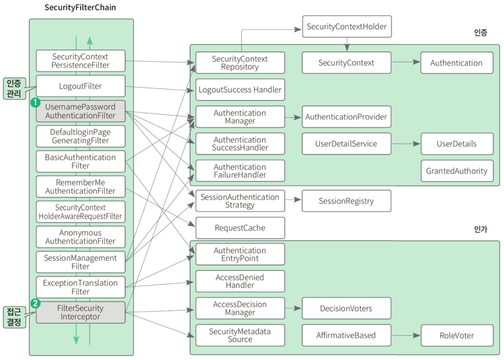
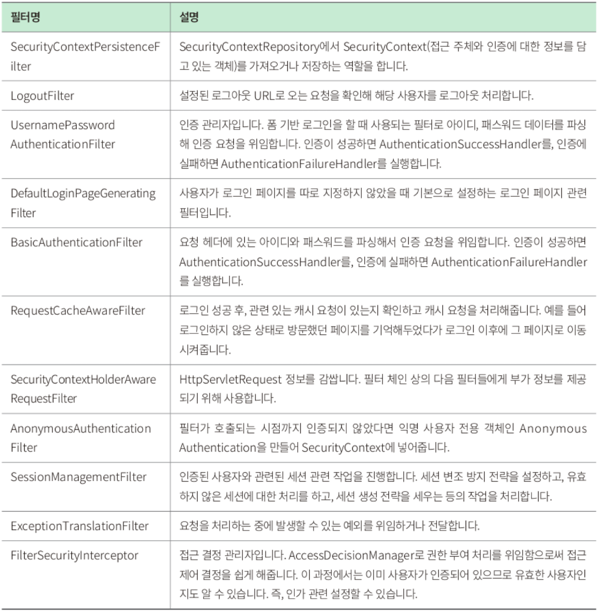
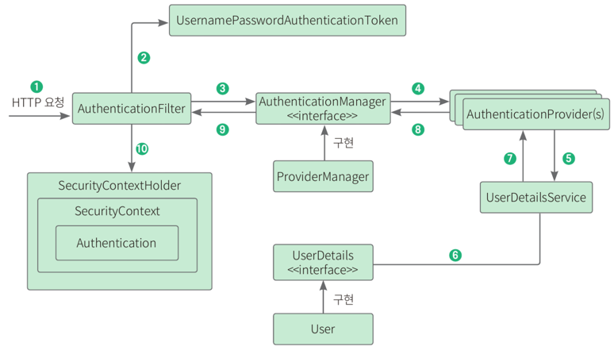

# 스프링 시큐리티
스프링 시큐리티는 스프링 기반의 애플리케이션 보안(인증, 인가, 권한)을 담당하는 스프링 하위 프레임워크이다.

## 인증과 인가
- 인증: 사용자가 사이트에 로그인할 때 누구인지 확인하는 과정
- 인가: 사이트의 특정 부분에 접근할 수 있는지 권한을 확인하는 작업

## 스프링 시큐리티
스프링 하위 프레임워크로 보안 관련 옵션을 많이 제공해준다. 애너테이션으로 설정도 매우 쉽다. 요청 헤더 보안 처리를 해주므로 개발자가 보안 관련 개발을 해야 하는 부담을 크게 줄여준다

### 필터 기반으로 동작하는 스프링 시큐리티

SecurityContextPersistenceFilter부터 시작해서 아래로 내려가며 FilterSecurityInterceptor까지 순서대로 
필터를 거친다. 필터를 실행할 때는 회색 화살표로 연결된 오른쪽 박스의 클래스를 거치며 실행한다. 특정 필터를 제거하거나 필터 뒤에 커스텀 필터를 넣는 등의 설정도 가능하다.
- UsernamePasswordAuthenticationFilter는 아이디와 패스워드가 넘어오면 인증 요청을 위임하는 인증 관리자 역할을 한다
- FilterSecurityInterceptor는 권한 부여 처리를 위임해 접근 제어 결정을 쉽게 하는 접근 결정 관리자 역할을 한다.


가장 많이 사용하는 아이디와 패스워드 기반 폼 로그인을 시도하면 스프링 시큐리티에서는 어떤 절차로 인증 처리를 하는지 알아보자.


1. 사용자가 아이디와 패스워드 입력 -> HTTPServletRequest에 아이디와 비밀번호 정보가 전달된다. 이때 AuthenticationFilter가 넘어온 아이디와 비밀번호의 유효성 검사를 한다.
2. 유효성 검사가 끝나면 실제 구현체인 UsernamePasswordAuthenticationToken을 만들어 넘겨준다
3. 전달받은 인증용 객체인 UsernamePasswordAuthenticationToken을 AuthenticationManager에게 보낸다
4. UsernamePasswordAuthenticationToken을 AuthenticationProvider에 보낸다
5. 사용자 아이디를 UserDetailService에 보낸다. UserDetailService는 사용자 아이디로 찾은 사용자의 정보를 UserDetails 객체로 만들어 AuthenticationProvider에게 전달한다
6. DB에 있는 사용자 정보를 가져온다
7. 입력 정보와 UserDetails의 정보를 비교해 실제 인증 처리를 한다.
8. 인증이 완료되면 SecurityContextHolder에 Authentication을 저장한다. 인증 성공 여부에 따라 성공하면 AuthenticationSuccessHandler, 실패하면 AuthenticationFailureHandler를 실행한다

# 회원 도메인 만들기
스프링 시큐리티를 사용해 인증, 인가 기능을 구현해보자. 회원 정보를 저장할 테이블을 만들고 테이블과 연결할 도메인을 만든 다음, 이 테이블과 연결할 회원 엔티티를 만들고, 회원 엔티티와 연결되어 데이터를 조회하게 해줄 리포지터리를 만든 후, 마지막으로 스프링 시큐리티에서 사용자 정보를 가져오는 서비스를 만든다.

## 의존성 추가하기
스프링 시큐리티를 사용하기 위해서는 build.gradle 파일에 의존성을 추가해야 한다.
```kotlin
implementation("org.springframework.boot:spring-boot-starter-security")
testImplementation("org.springframework.security:spring-security-test")
```

## 엔티티 만들기
domain 패키지에 User 파일을 구현한다

## 리포지터리 만들기
User 엔티티에 대한 리포지터리를 만든다. repository 디렉터리에 UserRepository.java 파일을 생성하고 인터페이스를 만들어준다.
```java
public interface UserRepository extends JpaRepository<User, Long> {
    Optional<User> findByEmail(String email); // email로 사용자 정보를 가져옴
}
```
이메일로 사용자를 식별할 수 있다. 즉, 사용자 이름으로 봐도 된다. 따라서 사용자 정보를 가져오기 위해서는 스프링 시큐리티가 이메일을 전달받아야 한다.
스프링 데이터 JPA는 메서드 규칙에 맞춰 메서드를 선언하면 이름을 분석해 자동으로 쿼리를 생성해준다. findByEmail 메서드는 데이터베이스에 회원 정보를 요청할 때 다음 쿼리를 실행한다.
FROM users WHERE email = #{email}

자주 사용하는 쿼리 메서드의 명명 규칙은 다음과 같다
- findByName()
- findByNameAndAge()
- findByNameOrAge()
- findByAgeLessThan()
- findByAgeGreaterThan()
- findByName(Is)Null()

## 서비스 메서드 코드 작성하기
service 디렉터리에 UserDetailService 파일을 생성하고 다음 코드 추가
```java
@RequiredArgsConstructor
@Service
// 스프링 시큐리티에서 사용자 정보를 가져오는 인터페이스
public class UserDetailService implements UserDetailsService {
    
    private final UserRepository userRepository;
    
    // 사용자 이름(email)으로 사용자의 정보를 가져오는 메서드
    @Override
    public User loadUserByUsername(String email) {
        return userRepository.findByEmail(email)
                .orElseThrow(() -> new IllegalArgumentException((email)));
    }
}
```
스프링 시큐리티에서 사용자의 정보를 가져오는 UserDetailsService 인터페이스를 구현한다. 필수로 구현해야 하는 loadUserByUsername() 메서드를 오버라이딩해서 사용자 정보를 가져오는 로직을 작성한다.

# 시큐리티 설정하기
인증을 뒤한 도메인과 리포지터리, 서비스가 완성되었으니 실제 인증 처리를 하는 시큐리티 설정 파일 WebSecurityConfig.java 파일을 생성한다.
```java
@RequiredArgsConstructor
@Configuration
public class WebSecurityConfig {
    
    private final UserDetailService userService;
    
    // 스프링 시큐리티 기능 비활성화
    @Bean
    public WebSecurityCustomizer configure() {
        return (web -> web.ignoring()
                .requestMatchers(toH2Console())
                .requestMatchers("/static/**"));
    }
    
    // 특정 HTTP 요청에 대한 웹 기반 보안 구성
    @Bean
    public SecurityFilterChain filterChain(HttpSecurity http) throws Exception {
        return http
                .authorizeHttpRequests() // 인증, 인가 설정
                .requestMatchers("/login", "/signup", "/user").permitAll()
                .anyRequest().authenticated()
                .and()
                .formLogin() // 폼 기반 로그인 설정
                .loginPage("/login")
                .and()
                .logout() // 로그아웃 설정
                .logoutSuccessUrl("/login")
                .invalidateHttpSession(true)
                .and()
                .csrf().disable() // csrf 비활성화
                .build();
    }
    
    // 인증 관리자 관련 설정
    @Bean
    public AuthenticationManager authenticationManager(HttpSecurity http, BCryptPasswordEncoder bCryptPasswordEncoder, UserDetailService userDetailService) throws Exception {
        return http.getSharedObject(AuthenticationManagerBuilder.class)
                .userDetailsService(userService) // 사용자 정보 서비스 설정
                .passwordEncoder(bCryptPasswordEncoder)
                .and()
                .build();
    }
    
    // 패스워드 인코더로 사용할 빈 등록
    @Bean
    public BCryptPasswordEncoder bCryptPasswordEncoder() {
        return new BCryptPasswordEncoder();
    }
}
```
- 스프링 시큐리티의 인증, 인가 서비스를 모든 곳에 적용하지는 않는다. 일반적으로 정적 리소스(이미지, HTML)에 설정한다. 정적 리소스만 스프링 시큐리티 사용을 비활성화하는 데 static 하위 경로에 있는 리소스와 h2의 데이터를 확인하는 데 사용하는 h2-console 하위 url을 대상으로 ignoring() 메서드를 사용한다.
- 특정 HTTP 요청에 대해 웹 기반 보안을 구성한다. filterChain 메서드에서 인증/인가 및 로그인, 로그아웃 관련 설정을 할 수 있다.
- 특정 경로에 대한 액세스 설정을 한다. 각 설정은 다음과 같다
  - requestMatchers(): 특정 요청과 일치하는 url에 대한 액세스를 설정한다.
  - permitAll(): 누구나 접근이 가능하게 설정한다. 즉, "/login", "/signup", "/user"로 요청이 오면 인증/인가 없이도 접근할 수 있다.
  - anyRequest(): 위에서 설정한 url 이외의 요청에 대해서 설정한다.
  - authenticated(): 별도의 인가는 필요하지 않지만 인증이 성공된 상태여야 접근할 수 있다.
- 폼 기반 로그인 설정을 한다. 각 설정은 다음과 같다
  - loginPage(): 로그인 페이지 경로를 설정한다.
  - defaultSuccessUrl(): 로그인이 완료되었을 때 이동할 경로를 설정한다.
- 로그아웃 설정은 다음과 같다
  - logoutSuccessUrl(): 로그아웃이 완료되었을 때 이동할 경로를 설정한다.
  - invalidateHttpSession(): 로그아웃 이후에 세션을 전체 삭제할지 여부를 설정한다.
- CSRF 설정을 비활성화한다. CSRF 공격을 방지하기 위해서는 활성화하는 게 좋지만 Rest api에서 client는 권한이 필요한 요청을 하기 위해서는 요청에 필요한 인증 정보를(OAuth2, jwt토큰 등)을 포함시켜야 한다. 따라서 서버에 인증정보를 저장하지 않기 때문에 굳이 불필요한 csrf 코드들을 작성할 필요가 없다.
- 인증 관리자 관련 설정은 사용자 정보를 가져올 서비스를 제정의하거나, 인증 방법, 예를 들어 LDAP, JDBC 기반 인증 등을 설정할 때 사용한다.
- 사용자 서비스를 설정한다.
  - userDetailService(): 사용자 정보를 가져올 서비스를 설정한다. 이때 설정하는 서비스 클래스는 반드시 UserDetailsService를 상속받은 클래스여야 한다.
  - passwordEncoder(): 비밀번호를 암호화하기 위한 인코더를 설정한다
- 패스워드 인코더를 빈으로 등록한다.

# 회원가입 구현하기
## 서비스 메서드 코드 작성하기
dto 디렉터리에 AddUserRequest 파일을 추가한 뒤 다음 코드 작성
```java
@Getter
@Setter
public class AddUserRequest {
    private String email;
    private String password;
}
```
다음으로는 AddUserRequest 객체를 파라미터로 받는 회원 정보 추가 메서드를 작성한다. service 디렉터리에 UserService 파일을 생성하고 다음 코드를 작성
```java
@RequiredArgsConstructor
@Service
public class UserService {
    
    private final UserRepository userRepository;
    private final BCryptPasswordEncoder bCryptPasswordEncoder;
    
    public Long save(AddUserRequest dto) {
        return userRepository.save(User.builder()
                .email(dto.getEmail())
                .password(bCryptPasswordEncoder.encode(dto.getPassword())) // 패스워드 암호화
                .build()).getId();
    }
}
```

## 컨트롤러 작성하기
controller 디렉터리에 UserApiController 파일을 생성하고 다음 코드를 작성
```java
@RequiredArgsConstructor
@Controller
public class UserApiController {
    
    private final UserService userService;
    
    @PostMapping("/user")
    public ResponseEntity<Void> signUp(AddUserRequest request) {
        userService.save(request); // 회원가입 메서드 호출
        return ResponseEntity.ok()
                .build();
        
//        return "redirect:/login"; // 메서드의 리턴값을 String으로 설정하고 이 코드를 작성하면 회원가입이 완료된 이후에 로그인 페이지로 이동할 수 있다.
    }
}
```

# 로그아웃 구현하기
## 로그아웃 메서드 추가하기
UserApiController 파일에 다음 코드 추가
```java
    @GetMapping("/logout")
    public ResponseEntity<Void> logout(HttpServletRequest request, HttpServletResponse response) {
        new SecurityContextLogoutHandler().logout(request, response,
                SecurityContextHolder.getContext().getAuthentication());
        return ResponseEntity.ok()
                .build();
    }
```
/logout GET 요청을 하면 로그아웃을 담당하는 핸들러인 SecurityContextLogoutHandler의 logout() 메서드를 호출해서 로그아웃한다.

# 실행 테스트하기
## 테스트를 위한 환경 변수 추가하기
application.yml에 환경 변수를 추가한다.
